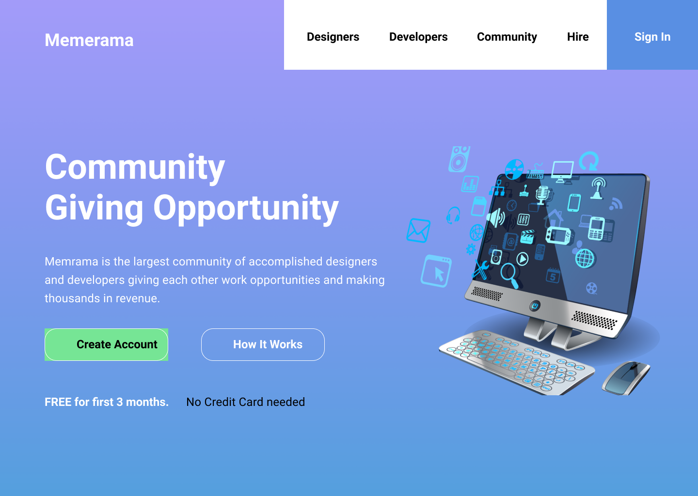
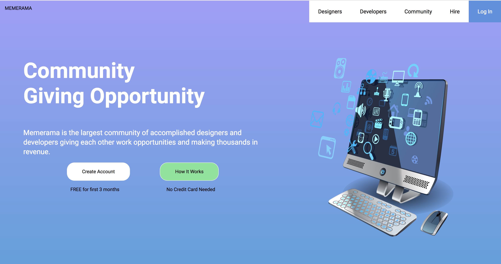

# Blue Header Mockup Recreation #1

This project was created using create-react. In order to run it locally, make sure you have Node installed. In the project's directory run "npm install" to fetch all dependencies and then "npm start" to launch the project on your local machine.

## Why this?

This is the first of many mockups I will be creating with React. As part of my goal to become a free lancing web developer I need to improve on my front-end skills. The original design was made in Figma.



What I created with React and some CSS

;

It is defnitiely not a finished product, but I feel like I've learned enough to work on my next project/mockup.

## What did I learn?

I had seen various tutorials on React on the past but never got around to working extensively with it for long periods of time. As such, this project was just to review on the basic syntax of creating components, html, and css. This project was also a refresher on Flexbox.

I learned that to use images with React I need to import the image or use an inline import using require.

```jsx

```
